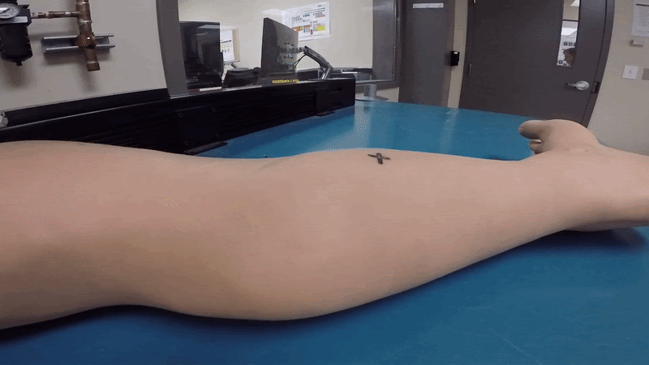

# Debugging Robot Data

Knowing how to read, decipher, and understand logs is critical to debugging robots.

## Challenge

This challenge uses logs from a [KUKA LBR iiwa 7](https://www.kuka.com/en-ca/products/robotics-systems/industrial-robots/lbr-iiwa) collaborative robot during a [contact distinction experiment](https://espace.etsmtl.ca/id/eprint/2461/).
The logged data was recorded at 1KHz.
Two scenarios were recorded: [collision with a metal table](.\table-s66-f12-i3386-20171205154324.log) and contact with a [mannequin human leg](.\human-s198-f19-i4358-20171205160445.log) (see gif below).
The motion is simple: the robot descends in Z until a collision is detected by the force controller and then retracts along the same direction.

Given the LOG files in this folder, answer the following questions for both scenarios:

1. What's the approximate velocity of the downwards motion?
2. What's the force measurement at the moment of contact?
3. What's the Z position at the moment of contact?
4. Given a collision force threshold of 19N for the leg and 12N for the table, how long does it take for the robot to react and start retracting?

Bonus points if a script or tool is used to make the process more efficient.
