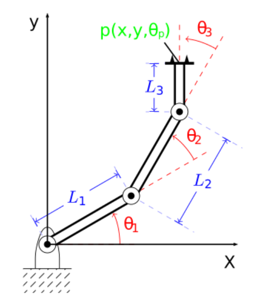

# Inverse Kinematics

This challenge evaluates your coding skills and basic robotics/controls
knowledge.

## Challenge

- Feel free to write in C\#, C++, or Java.
  - Add clear build instructions and (if applicable) a build
    file (e.g., Makefile, gradle, maven, CMake)
- Do not plagiarize, and provide citations if needed
- Do not use a kinematics library, but implement your own solution
    - You should not need a mathematics/matrix library either, but
    if it results in cleaner code feel free to use one
- We are looking for good programming practises demonstrating clean, re-usable, extendable, and maintainable code.
  - Each step builds on code written in the previous steps.
- Feel free to make assumptions and document them if information is missing in the case.
- Provide test cases using a common testing platform for your language (e.g., JUnit for Java)
    - Bonus points: Use test driven development
- Add documentation where necessary
  - Document public API functions
- Use good class, function, and variable names
- Develop against a local git repository, and commit at least after every question.
    - If using test driven development, show that using commits
- Send the whole repository (including the .git directory) when finished as a zip archive

### Task 1: Model

Implement the kinematics for the manipulator model shown below.
The manipulator consists of 3 links, with lengths L1, L2, and
L3 and corresponding joint angles (θ1,θ2,θ3).

- Create an object oriented model of the robot to store the parameters
- Use reasonable defaults for the parameters and make them easy to change

### Task 2: Forward Kinematics

We want to know the end effector position p(x,y,θp) based on
the joint angles (θ1,θ2,θ3)

- Create an implementation of the forward kinematics of the manipulator using the manipulator model created
- Create test cases for the forward kinematics

### Task 3: Intersection

Given a circle with midpoint (x,y) and radius r, we want to know if the
end effector position p(x,y,θp) is in that circle.

- Create a function that tests if the manipulator is in the circle,
  given x,y,r and the joint angles
  (θ1,θ2,θ3)
- Provide test cases for the intersection

## Task 4: Inverse kinematics

Given an end effector position p(x,y,θp), we want to know the
joint angles (θ1,θ2,θ3)

- Create an inverse kinematics solver for the model created in
  section 1).
  - Either go for an algebraic solution or numerical solution
  - Bonus for providing all feasible solutions
- Create test cases for the inverse kinematics solver
