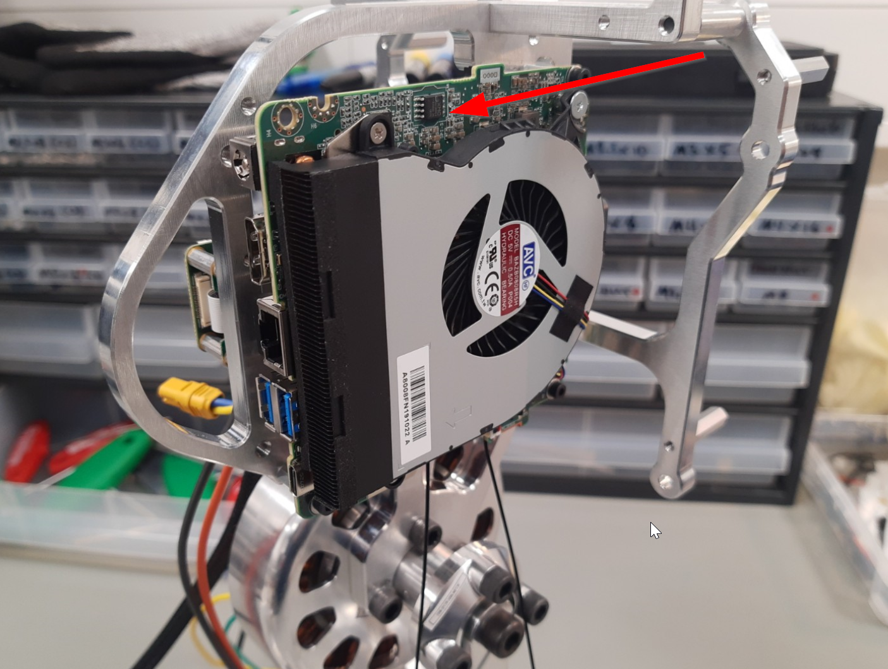
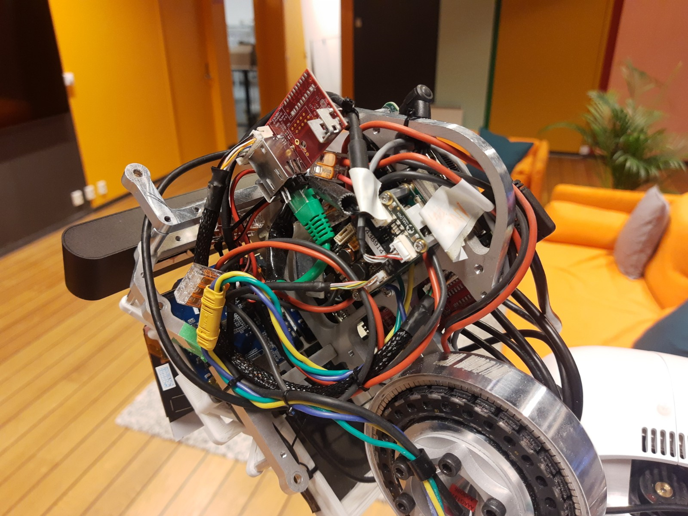
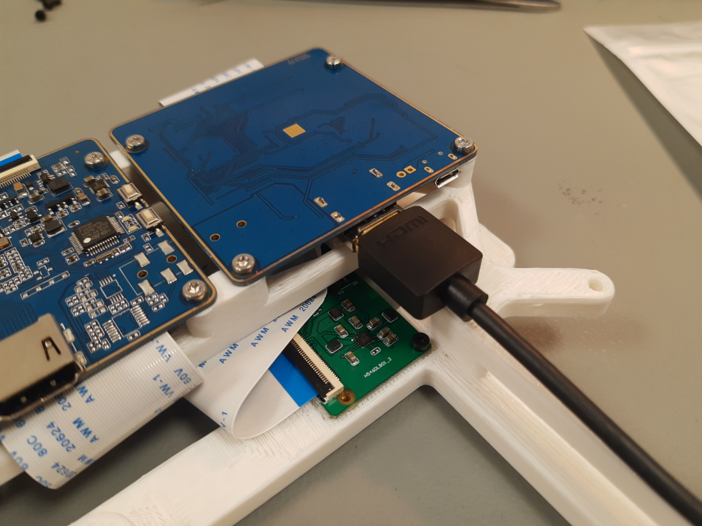
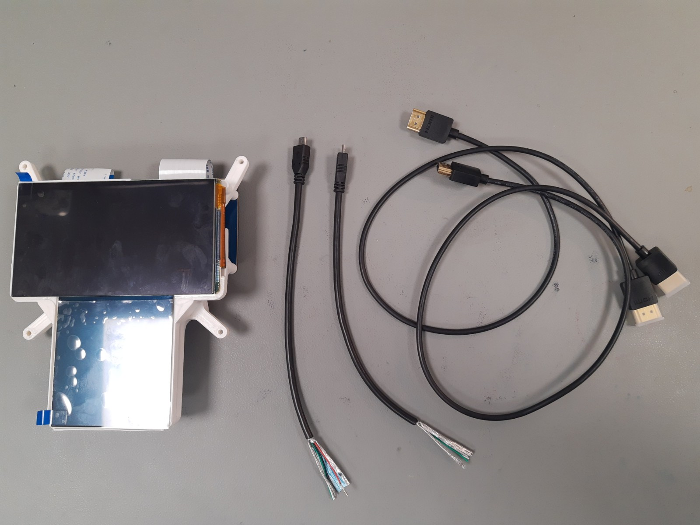
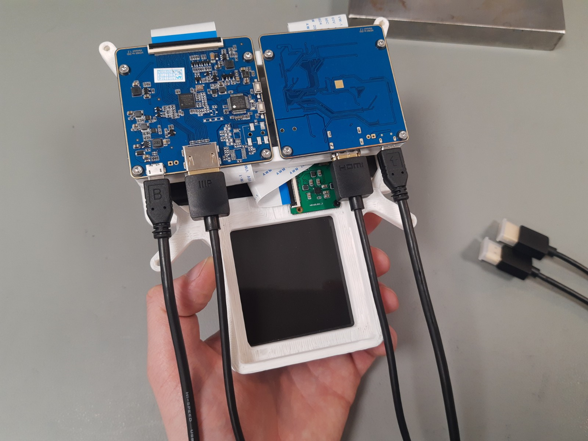
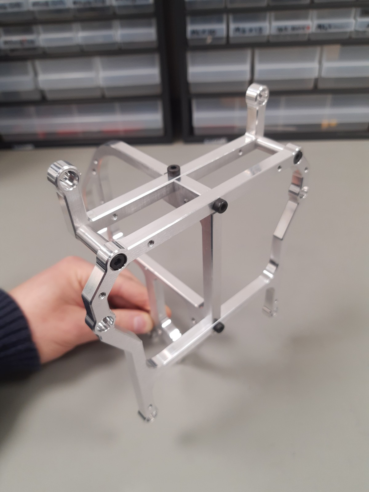
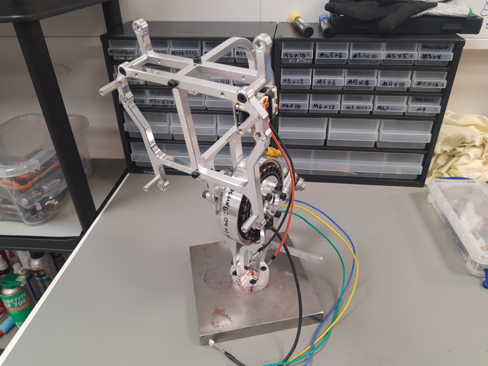
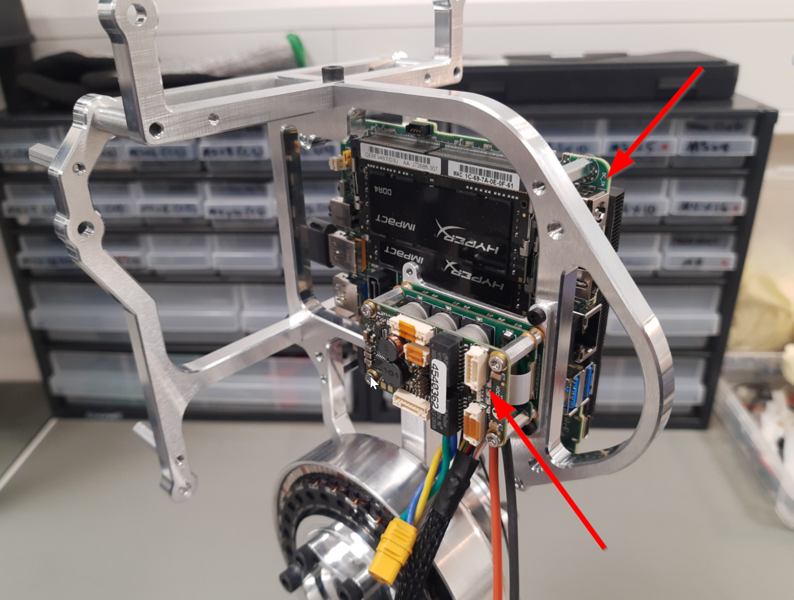

# Maintenance and Repairs

The EVE robotic platform will be deployed to several pilot projects over the coming year and maintenance is important.

## Challenge

Given the following photos of an old R&D unit below, answer the following questions and submit your responses back to your hiring manager by email.
Screenshots, diagrams, and any other insights or creative approaches are welcome.

1. How would you approach replacing the embedded PCB assembly (red arrow) given the full assembly (second photo)?

2. What are these blue PCBs for?

3. How would you design the inner head frame for better Design for Maintenance, Design for Manufacturing (DFM), and Design for Assembly (DFA)?

4. What are the two PCB assemblies pointed to in the images below?

